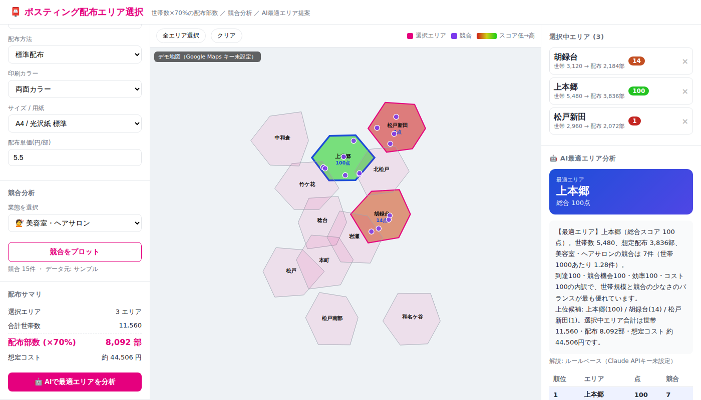
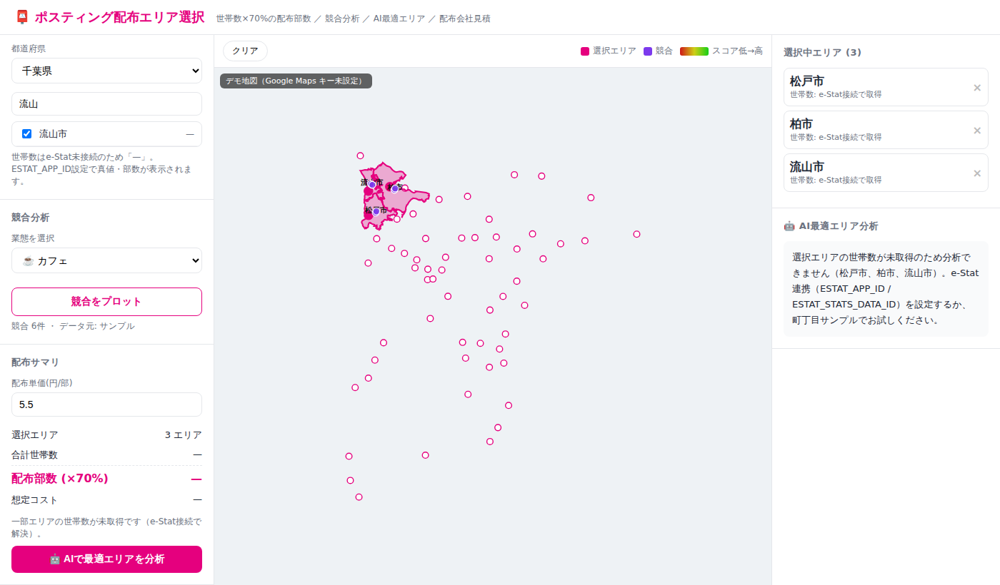

# ポスティング配布エリア選択システム

ラクスルの「地図から簡単注文」のように、**地図上でポスティング配布エリアを選び、配布部数を自動算出**するWebアプリのMVPです。カート/注文機能は持たず、**配布部数の算出とAIによる最適エリア分析に特化**しています。

- 🗾 **全国自治体対応** … 47都道府県・全1,916市区町村から選択。境界ポリゴンはオンデマンド取得＋キャッシュ
- 🏘️ **町丁目（小地域）配布** … より細かい町丁目単位でも選択可能（松戸市サンプル同梱／e-Stat小地域に差し替え可）
- 📮 **配布部数の自動算出** … 各エリアの世帯数（国勢調査／住民基本台帳）に対して **70%** を配布部数とする
- 🔍 **競合分析** … 業態を選ぶと、その業態の競合が地図上にプロットされる
- 🤖 **AIによる最適エリア分析** … 世帯規模・競合密度・配布効率・コストをスコア化し、最適エリアをAIが提案・解説
- 🚚 **配布会社の原価・見積** … 選択エリアの各配布会社の原価/見積単価を集計（実データを徐々にプロットしていく土台）

| 町丁目 配布 | 市区町村 配布（全国） |
|---|---|
|  |  |

## クイックスタート

```bash
npm run install:all          # ルート / server / client の依存をインストール
npm run dev                  # server:4000, client:5173（→ http://localhost:5173）

# 本番ビルド＋単一サーバー起動（http://localhost:4000）
npm run build && npm start
```

APIキーが未設定でも動作します。**町丁目モード（松戸市サンプル）は部数算出〜AI分析〜見積までフルに動作**します。

## データの実データ性と充填元

| データ | この状態での挙動 | 実データ源（実運用） |
|--------|------------------|----------------------|
| 全国市区町村マスタ（コード・名称・重心） | ✅ 実データ同梱（1,916件） | [localgovjp](https://github.com/code4fukui/localgovjp) |
| 市区町村の**世帯数** | ⚠️ 未接続時は `null`（部数は「—」表示）。**捏造値は入れていません** | **e-Stat API**（国勢調査／住基）|
| 市区町村の**境界ポリゴン** | ✅ 選択時にオンデマンド取得＋キャッシュ | **e-Stat 統計GIS 境界データ**（推奨）／[niiyz/JapanCityGeoJson](https://github.com/niiyz/JapanCityGeoJson)（キー不要フォールバック）|
| 町丁目（松戸市）世帯数・境界 | ✅ サンプル同梱で動作 | e-Stat 小地域（世帯数＋境界データ）|
| 競合POI | ✅ サンプル生成／実POI取得 | Google Places API →（キー無ければ）OpenStreetMap Overpass |
| 配布会社 原価・見積 | ✅ サンプル同梱 | 各社と連携して蓄積（`server/data/pricing.sample.json`）|

> **世帯数について**: 「配布部数＝最新世帯数×70%」の**世帯数の正データはe-Stat**です。本リポジトリのビルド環境ではe-Statへ到達できないため、市区町村の世帯数は未接続時 `null`（誤った推計値は表示しない方針）。`ESTAT_APP_ID` を設定すると全国の部数が真値で算出されます。町丁目サンプル（松戸市）はデモ用に世帯数を同梱しています。

## 環境変数（`.env.example` を `.env` にコピー）

| 変数 | 用途 | 未設定時 |
|------|------|----------|
| `GOOGLE_MAPS_API_KEY` | 地図表示（Maps JavaScript API） | SVGデモ地図で描画 |
| `GOOGLE_PLACES_API_KEY` | 競合POI検索（Places API New） | Overpass → サンプルにフォールバック |
| `ESTAT_APP_ID` / `ESTAT_STATS_DATA_ID` | 世帯数の実データ（e-Stat getStatsData） | 世帯数は取得せず `null` |
| `BOUNDARY_BASE` | 境界GeoJSONの取得元ベースURL | niiyz raw GitHub |
| `ANTHROPIC_API_KEY` / `CLAUDE_MODEL` | 最適エリアのAI解説（Claude API） | ルールベース解説 |
| `PRICING_DATA_PATH` | 配布会社 原価・見積データのパス | 同梱サンプル |

### e-Stat（世帯数）の接続手順と疎通確認
1. [e-Stat API](https://www.e-stat.go.jp/api/) でアプリケーションID(appId)を取得し `.env` の `ESTAT_APP_ID` に設定
2. **疎通確認スクリプトを実行**（statsDataId未設定なら候補を検索表示）:
   ```bash
   npm --prefix server run estat:check
   ```
3. 表示された候補から市区町村別世帯数の表を選び `ESTAT_STATS_DATA_ID` に設定して再実行。
   スクリプトが「接続 → メタ検出（世帯数分類の自動判定）→ 世帯数取得 → 全国マスタとの結合率」を検証し、
   松戸市などサンプル自治体の `世帯数 → 配布部数(×70%)` とPASS/FAILを表示します。
4. PASSしたら `server` を再起動すると、市区町村モードで**真値の配布部数**が表示されます。
5. 自動検出が合わない表では `ESTAT_HOUSEHOLD_CLASS` / `ESTAT_HOUSEHOLD_CODE` / `ESTAT_TIME_CODE` で明示できます。

> 実装は `server/services/estatClient.js`（getStatsList/getMetaInfo/getStatsData）。世帯数分類の検出・
> `@area`→市区町村コードの結合・全国/都道府県の除外・最新年フィルタを行います。パースは
> `npm --prefix server test`（`server/test/estatClient.test.mjs`, モック16項目）で検証済み。
> 町丁目（小地域）を実データ化する場合は、境界（e-Stat統計GIS）と世帯数を KEY_CODE で結合します。

## アーキテクチャ

```
server/                     Node.js + Express API
├── routes/
│   ├── areas.js            /api/areas         町丁目エリア（世帯数・部数・ポリゴン）
│   ├── municipalities.js   /api/municipalities 全国自治体一覧・都道府県・境界オンデマンド
│   ├── competitors.js      /api/competitors   業態マスタ・競合検索
│   ├── analyze.js          /api/analyze       最適エリア分析（スコア+見積+AI解説）
│   └── pricing.js          /api/pricing       配布会社一覧・見積
├── services/
│   ├── estat.js            世帯数（e-Stat充填 or サンプル）＋ 配布率70%
│   ├── boundaries.js       境界のオンデマンド取得・簡略化・キャッシュ
│   ├── areas.js            コード+粒度 → エリア解決（境界結合）
│   ├── places.js           競合検索（Google → Overpass → サンプル）
│   ├── scoring.js          4軸スコアリング（世帯数nullは対象外）
│   ├── pricing.js          配布会社 原価・見積
│   ├── claude.js           Claude API 解説（or ルールベース）
│   └── geo.js              内包判定・面積・重心・距離・簡略化(DP)
└── data/
    ├── municipalities.json      全国市区町村マスタ（実データ）
    ├── households.sample.json   松戸市 町丁目サンプル
    ├── business-types.json      業態マスタ
    ├── pricing.sample.json      配布会社 原価・見積サンプル
    └── boundaries/              取得済み境界のキャッシュ

client/                     React + Vite
└── src/
    ├── App.jsx                  2モード（町丁目 / 市区町村）状態管理
    ├── components/
    │   ├── GoogleMapView.jsx    Google Maps（ポリゴン+候補点+競合）
    │   └── SvgMapView.jsx       キー未設定時のSVGフォールバック地図
    └── lib/{api,googleMaps}.js
```

## スコアリングの考え方（`server/services/scoring.js`）

| 軸 | 指標 | 重み |
|----|------|------|
| 到達 (reach) | 世帯数（配布到達数） | 35% |
| 競合機会 (opportunity) | 世帯数 ÷ (競合数+1) | 30% |
| 配布効率 (efficiency) | 世帯密度 | 20% |
| コスト効率 (cost) | 到達世帯 ÷ 配布コスト（配布会社の最安見積単価を反映） | 15% |

各軸を0–100に正規化し重み付け。世帯数が未取得のエリアは対象外（`skipped`）として明示します。`ANTHROPIC_API_KEY` を設定するとClaudeが最適エリアの理由・優先度・予算配分を日本語で解説します。

## 今後の拡張

- **配布会社の原価・見積を徐々にプロット** … `pricing.sample.json` を各社実データに差し替え／エリア別単価を蓄積（データモデルは実装済み）
- e-Stat 小地域境界を用いた全国の町丁目配布
- 競合の口コミ評価を加味したスコアリング、商圏（到達圏）解析
```
